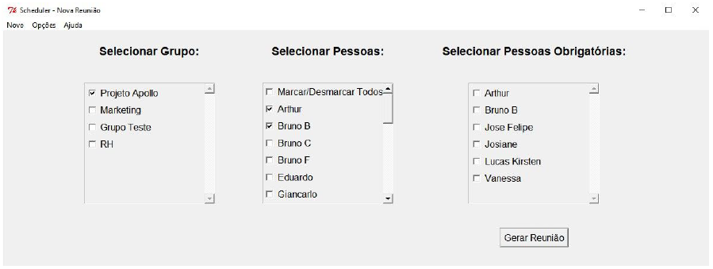
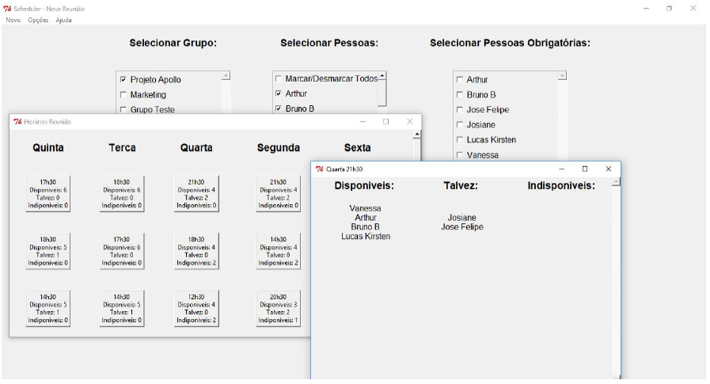
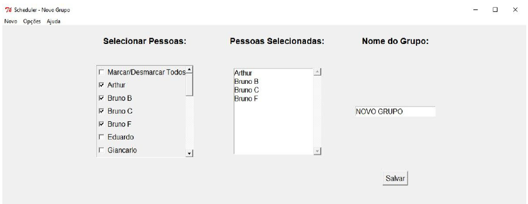

# Scheduler

Marcador de reuniões automático com base nos horários dispostos em uma planilha de Excel. Manual do usuário completo disponível em português.

>Auto scheduler basead on the schedules in a Excel spreadsheet. Full user guide avaliable in portuguese.

## Pré-requisitos (Prerequisites)

- Python 2.7
- Pandas

## Visão Geral (General view)

### Tela para marcar reuniões (Screen to schedule meetings)
Tela de seleção dos participantes das reuniões com opção de selecionar grupos pré-definidos e pessoas com participação obrigatória.

### Horários para possíveis reuniões (Time for possible meetings)
Lista de horários possíveis para a reunião, com cada horário sendo possível verificar as pessoas disponíveis e indisponíveis.

### Criação de grupos (Group creation)
Criação de grupos pré-definidos para reuniões.

## Autores

Desenvolvido para empresa Sinc Jr. pelos colaboradores Lucas Kirsten, Luiz Gatelli e Felipe Ihjaz.

>Developed by Sinc Jr.
